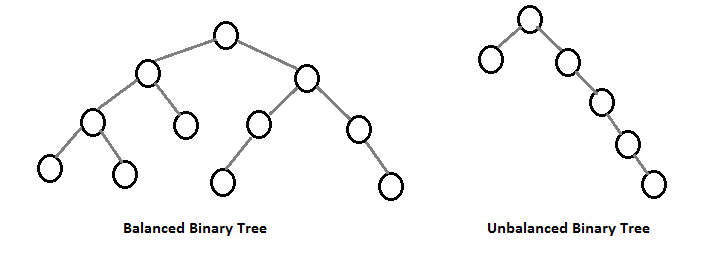
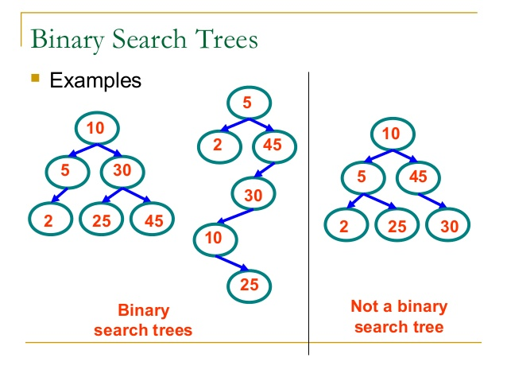

# Binary Search Trees

In order to talk about Binary Search Trees we need to talk about a Binary tree. Binary trees are similar to linked lists with how they have the ability to tradverse themselves. Unlike linked lists, Binary trees can connect to multiple nodes.

The image below shows how a binary tree looks like.


The top node is called the root of the tree. Below it are parents and children. The bottom nodes are children to the higher node or parents. As you add data to the tree it can become unbalanced. In a binary tree thia doesn't matter so much. Binary Search Trees on the other hand fix this problem.



Binary Search Trees use the data inputed to balance themselves. They also follow a rule set in which if node is greater then the root it goes to the right of the root and less goes left. Binary Search Trees when balanced use O(log(N)) vs unbalanced O(N). The preformace difference is huge. For the examples we will just look at the Binary Search Trees due to their suppior speeds and efficiency.



## Inserting

First we will go over inserting into Binary Search Trees. Like linked lists, we will insert into a node. That node will be placed to the left or right side of the tree depending on the root.

```py
    def _insert(self, data, node):

        if data != node.data: #checks to see if the data you're inserting is the same as another node
            if data <= node.data:
                # The data belongs on the left side.
                if node.left is None:
                    # We found an empty spot
                    node.left = BinarySearchTree.Node(data)
                else:
                    # Need to keep looking.  Call _insert
                    # recursively on the left sub-tree.
                    self._insert(data, node.left)
            elif data >= node.data:
                # The data belongs on the right side.
                if node.right is None:
                    # We found an empty spot
                    node.right = BinarySearchTree.Node(data)
                else:
                    # Need to keep looking.  Call _insert
                    # recursively on the right sub-tree.
                    self._insert(data, node.right)
```

## Tradversing through the tree

In order to move through the tree we need to make a function that allows us to move forward through the tree. The node will continue to tradverse forward until there is no more nodes to the right it can tradverse through.

```py
  def _traverse_forward(self, node):

        if node is not None: #checks to see that the node has data
            yield from self._traverse_forward(node.left)
            yield node.data
            yield from self._traverse_forward(node.right)
```

## Recurtion

In order to move through the Binary Search Tree we use recurtion which just means having the function call itself recursively.
For example the insert function below will add nodes to both the left and right side of the tree and the function will keep calling itself until it reaches the end of the data sent into it.

```py

def _insert(self, data, node):
    if data != node.data: #prevents the same item from being stored twice
        if data <= node.data:
            # The data belongs on the left side.
            if node.left is None:
                # We found an empty spot
                node.left = BinarySearchTree.Node(data)
            else:
                # Need to keep looking.  Call _insert
                # recursively on the left sub-tree.
                self._insert(data, node.left)
        elif data >= node.data:
            # The data belongs on the right side.
            if node.right is None:
                # We found an empty spot
                node.right = BinarySearchTree.Node(data)
            else:
                # Need to keep looking.  Call _insert
                # recursively on the right sub-tree.
                self._insert(data, node.right)
```

## Example

The example below will of a list of 10 numbers. With this tree we can tradverse forward through the list of 10 numbers starting from the lowest to the highest number.

```py
class BinarySearchTree:
    class Node:
        def __init__(self, data):
            self.data = data
            self.left = None
            self.right = None

    def __init__(self):
        self.root = None

    def insert(self, data):
        if self.root is None:
            self.root = BinarySearchTree.Node(data)
        else:
            self._insert(data, self.root)  # Start at the root

    def _insert(self, data, node):
        if data < node.data:
            # The data belongs on the left side.
            if node.left is None:
                # We found an empty spot
                node.left = BinarySearchTree.Node(data)
            else:
                # Need to keep looking.  Call _insert
                # recursively on the left sub-tree.
                self._insert(data, node.left)
        else:
            # The data belongs on the right side.
            if node.right is None:
                # We found an empty spot
                node.right = BinarySearchTree.Node(data)
            else:
                # Need to keep looking.  Call _insert
                # recursively on the right sub-tree.
                self._insert(data, node.right)

         
    def __iter__(self):
        yield from self._traverse_forward(self.root)  # Start at the root
        
    def _traverse_forward(self, node):
        if node is not None:
            yield from self._traverse_forward(node.left)
            yield node.data
            yield from self._traverse_forward(node.right)      

tree = BinarySearchTree()
tree.insert(5)
tree.insert(3)
tree.insert(7)
tree.insert(10)
tree.insert(1)
for x in tree:
    print(x)  # 1, 3, 5, 7, 10
```

Note how recurtion is used to move through the tree.

## Problem Set

There are two problems to be worked on. First is there is a new truck for sall. We will use Binary Search Trees to see how much the truck under sold or over sold for. The second we will use a Binary Search Tree to sort a group of words from smaller to larger words.
The requirments for both Binary Search Trees

* Be able to iterate backwards

* Be able to correctly find the height of the tree

* Recersue effectively
  
Word Binary Search Tree special requirments

* Words are correctly placed and the tree is balanced correctly.

* Be able to insert into the middle of the tree
