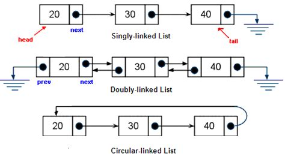

# Linked Lists (talk about performance of linked lists)

A Linked list is simular to a queue. The difference is with a linked list, you can free tradverse the nodes as they are conected to each other through heads and tails. There is both a single, double and circular versions. Linked lists are the type of data structure you would use to make a music player or keep track of where you been so you can go back. In this tutorial I will explain how linked lists work.

The image below shows how a linked list work in it's 3 differnt forms.



Lets say we are going to be using linked lists to look at the chain of command for some big company. We will go over the differnt types of linked lists and how they can show the chain of command.

## Types of Linked Lists

### Single Linked Lists

First we will go over the single linked list. Single linked lists can only tradverse one way. To do so will will be using a node like we did with queues but we will use a varaible called the head which represents the first node.

```py
    class ChainOfCommand:
        class Person:
        def __init__(self, data):
            self.data = data
            self.next = None
            self.prev = None
    def __init__(self):
        self.head = None
    def insert_head(self, value):
        # Create the new node
        new_node = LinkedList.Node(value)  
        if self.head is None:
            self.head = new_node
        # If the list is not empty, then only self.head will be
        # affected.
        else:
            new_node.next = self.head # Connect new node to the previous head
            self.head.prev = new_node # Connect the previous head to the new node
            self.head = new_node
    linked = ChainOfCommand
    linked.insert_head("CEO Jeff")
    linked.insert_head("CFO Katty")
    linked.insert_head("Regional Director Johnny")
    linked.insert_head("Engineering head director Jim")
    linked.insert_head("Operations manager Kim")
    linked.insert_head("Manger Sam")
```

Now we have created a new node that contains the chain of command. With this type of linked list we can only move towards the tail or bottom of command.

### Double Linked Lists

Double Linked lists allow for us to tradverse the linked list.
We can go from begining to end and vise versa. If you try to go forward when your at the tail or vise versa the linked list will prevent it because there's nothing there.

```py
    class ChainOfCommand:
        class Person:
        def __init__(self, data):
            self.data = data
            self.next = None
            self.prev = None
    def __init__(self):
        self.head = None
        self.tail = None
    def insert_head(self, value):
        # Create the new node
        new_node = LinkedList.Node(value)  
        if self.head is None:
            self.head = new_node
            self.tail = new_node
        # If the list is not empty, then only self.head will be
        # affected.
        else:
            new_node.next = self.head # Connect new node to the previous head
            self.head.prev = new_node # Connect the previous head to the new node
            self.head = new_node
    linked = ChainOfCommand
    linked.insert_head("CEO Jeff")
    linked.insert_head("CFO Katty")
    linked.insert_head("Regional Director Johnny")
    linked.insert_head("Engineering head director Jim")
    linked.insert_head("Operations manager Kim")
    linked.insert_head("Manger Sam")
```

### Circular Linked Lists

When you reach the end of your linked list and want to keep moving forward or are the begining and want to go back, we need to use a circular linked list to allow us to loop back to either the beging or end. In this example I made a class to allow you to choose how you want to tradverse through the linked list

```py

    def menu(self):
        yes = True
        chain = self.head
        chain.open(chain.data)
        while yes:
            print("Please choose How you would like to navigate through the chain of command ")
            choice = input("n for next chain, p for previous ")
            if choice == "n":
                chain = chain.next
                print(chain.data)
            if choice == "p":
                chain = chain.prev
                if chain is None:
                    chain = self.tail
                    print("test")
                else:
                    print("test 2")
                    print(chain.data)
    linked = ChainOfCommand
    linked.insert_tail("CEO Jeff") #You insert into the tail or end of the linked list to have~
    linked.insert_tail("CFO Katty")#~the first result to be the first item you input
    linked.insert_tail("Regional Director Johnny")
    linked.insert_tail("Engineering head director Jim")
    linked.insert_tail("Operations manager Kim")
    linked.insert_tail("Manger Sam")
```

## Performance

The insert_head function is O(1) along with insert_tail. The removal functions share the same performance. Both a size or if empty operation would also be O(1). If you were to insert or remove a value in the linked list after the head or before the tail the preformance would be O(N)

## Example

To contiue the linked list example from before, we will say that we need to add someone to the end of the chain of command as well as the top. We will also replace someone and remove another.

```py
class ChainOfCommand:
    class Person:
        def __init__(self, data):
            self.data = data
            self.next = None
            self.prev = None

    def __init__(self):
        self.head = None
        self.tail = None

    def insert_head(self, value):
        # Create the new node
        new_node = LinkedList.Node(value)  
        # If the list is empty, then point both head and tail
        # to the new node.
        if self.head is None:
            self.head = new_node
            self.tail = new_node
        # If the list is not empty, then only self.head will be
        # affected.
        else:
            new_node.next = self.head # Connect new node to the previous head
            self.head.prev = new_node # Connect the previous head to the new node
            self.head = new_node      # Update the head to point to the new node

    def remove_head(self):
        # If the list has only one item in it, then set head and tail
        # to None resulting in an empty list.
        if self.head == self.tail:
            self.head = None
            self.tail = None
        # If the list has more than one item in it, then only self.head
        # will be affected.
        elif self.head is not None:
            self.head.next.prev = None  # Disconnect the second node from the first node
            self.head = self.head.next  # Update the head to point to the second node

    def replace(self, old_value, new_value):
        curr = self.head  # Start at the begining since this is a forward iteration.
        while curr is not None:
            if curr.data == old_value:
                curr.data = new_value
            curr = curr.next
    def remove(self, value):
        curr = self.head  # Start at the begining since this is a forward iteration.
        while curr is not None:
            if curr.data == value:
                curr.prev.next = curr.next
                curr.next.prev = curr.prev
            curr = curr.next

    def __iter__(self):
        curr = self.head  # Start at the begining since this is a forward iteration.
        while curr is not None:
            yield curr.data  # Provide (yield) each item to the user
            curr = curr.next # Go forwrd in the linked list

    def __str__(self):
        output = "linkedlist["
        first = True
        curr = self.head
        while curr is not None:
            if first:
                first = False
            else:
                output += ", "
            output += str(curr.data)
            curr = curr.next
        output += "]"
        return output
    linked = ChainOfCommand
    linked.insert_head("Manger Sam")
    linked.insert_head("Operations manager Kim")
    linked.insert_head("Engineering head director Jim")
    linked.insert_head("Regional Director Johnny")
    linked.insert_head("CFO Katty")
    linked.insert_head("CEO Jeff")
    linked.insert_head("Superviser Matt")
    #Next we will replace someone
    linked.replace("Operations manager Kim","Operations manager Ashley")
    linked.remove("Engineering head Kim")
```

Note remove goes through each node to find the one that contains the person you wish to remove.

## Problem Set

There are two problems to be worked on. First is a  circular Linked list for websites. The other is a music Linked list, this will act as an mp3 player which will allow you to skip songs and go back and forth.

The requirments for both Linked Lists

* Handle 10 items in the linked lists

* Be able to iterate back and forth

* If you reach the end, it should take you back to the begining
  
Music queue special requirments

* Music can be paused and resumed.

* Can replace and delete songs.

[Linked list website problem](LinkedWebSitesProblem.py)

[Linked list website solution](LinkedMusicSolution.py)

[Linked list music problem](LinkedMusicProblem.py)

[Linked list music solution](LinkedMusicSolution.py)
