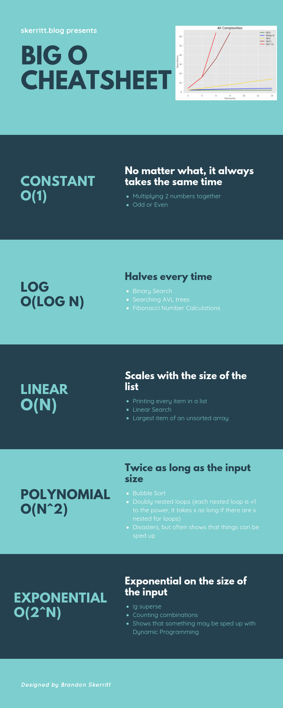

# Queues (add preformace for queues)

A Queue is a word we hear in a lot of differnt context. When you buy something online, your order is placed into a queue waiting to be processed. When you are standing in line at the store, you are in a queue waiting to be served. Queues work simulary in coding, first in first out. This tutorial will teach you how to create queues. 

Lets say we are making a queue that has people on hold for customer support. We would have both a name a priority number to repersent their place in the queue.

```py
    person1 = ("bill", 1)
    person2 = ("jill", 2)
    person3 = ("mill", 3)
```

## Importance of preformance

In order for this to work we need to go over the differnt types of queues and how they work.
Preformance is how quickly an operation can be performed. We call it big O notation due to the algorithum it uses.


This Graph shows the different types of preformance you can get from O(1) being the best where O(N!) is the worst.

Below is an example of what O(N^2) looks like. If you were to add a thrid for loop you would end up with O(N^3)

```py
def Sort(list):
    n = len(list)
 
    # Traverse through all array elements
    for y in range(x):
 
        # Last i elements are already in place
        for z in range(0, x-y-1):
 
            # traverse the array from 0 to n-i-1
            # Swap if the element found is greater
            # than the next element
            if list[z] > list[z+1] :
                list[z], list[z+1] = list[z+1], list[z]
 
# Driver code to test above
list = [1,2,3,4,5,6,7,8,9,10]

```

As we can see the preformance is bad due to having to loop through the data twice when it only needs to be looped once if that.Below is what O(1) preformance looks like.

```py
def OddOrEven(x):
    if x % 2:
        print("Even")
    else:
        print("Odd")

```

This uses O(1) preformance due to the data being cut in half to see if the if statment is true or false


As we can see O(1) preformance is pretty much instant where O(N!) takes an eternity to complete.
Having better Big O notation makes a huge difference when working on a project with a large amout of code. Through out this tutorial I will be going over the preformaces of the data structures and the importance of them.

## Types of Queues

Enqueueing is how you add information to the queue. It uses O(1) speed to do so.

```py
    queue.append(person1)
```

Dequeueing allows you to remove information from the queue.
We can do this one of two ways, using the del funtion to delete the item or pop().
Dequeueing uses O(n) preformance.

```py
    queue.del(person1)
    queue.pop(person1)
```

When working with queues, we will need to get the size of the queue and check if its empty. If you were to have a set queue and there were 5 people in it and no one else needed to be added to it, you would need the size to run a program for as many items are in the queue and when its reaches empty you would want to check if its empty. This uses O(1) preformance.

```py
    queue.size(person1)
    if queue == 0:
        print("Queue is empty")
```

## Example

To contiue the queue example from before, we have a queue of 5 people waiting to get helped. We need to take their information and add it to the queue then remove them after they are helped. When the queue reaches empty a message will display.

```py
class Call_center:

    class Phone_Queue:
        def __init__(self, person):
            self.person = person

        def connect_person(self):
            print("Name of whom is being helped {}".format(self.person))

    def __init__(self):
        self.phone_queue = []

    def request_person(self, person):
        request = Call_center.Phone_Queue(person)
        self.phone_queue.append(request)

    def process_next_person(self):
        if len(self.phone_queue) > 0:
            call = self.phone_queue[0]
            del self.phone_queue[0]
            call.connect_person()
        else:
            print("The queue is empty.")

print("Test 1")
switch = Call_center()
switch.request_person("joe")
switch.request_person("betty")
switch.request_person("jerry")
switch.request_person("bill")
switch.request_person("joyce")
switch.process_next_person()
switch.process_next_person()
switch.process_next_person()
switch.process_next_person()
switch.process_next_person()
switch.process_next_person()
```

Note that after joyce I asked to process the next person which caused it to display the list was empty.

## Problem Set

There are two problems to be worked on. First is a queue for people who wanted to buy Xbox's for Christmas. The other is a music queue, that takes songs, adds them to the queue then plays the music and removes it afterwards.

The requirments for the Xbox queue

* Handle 10 people in the queue.

* Have priority for who ordered their first.

* If two people have the same priority number have the first one in the queue go first.
  
* Queue must display it is empty when the queue reaches 0

[Xbox queue problem](QueueXboxProblem.py)

[Xbox queue solution](QueueXboxSolution.py)

[Music queue problem](QueueXboxProblem.py)

[Music queue solution](QueueMusicSolution.py)
